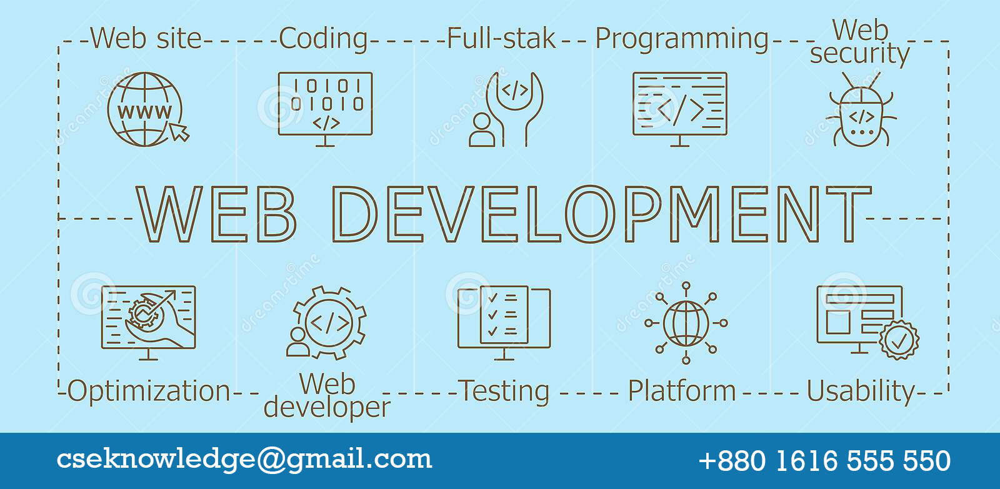
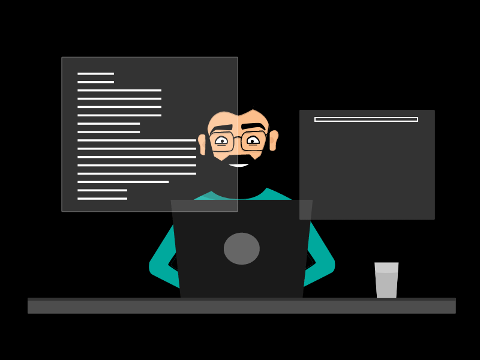

<!-- banner image starts here  -->

<!-- banner image ends here  -->

<h1 align="center">As-salamu Alaikum, I'm Arif Dewan </h1>
<h3 align="center">Full stack software engineer  </h3>
<h5 align="center">🏠 &nbsp; Living: Tongi, Gazipur, Bangladesh</h5>

<!-- Contact me section starts here  -->

[][website]
[][youtube]
[][facebook]
[][linkedin]
 
 

<!-- Contact me section ends here  -->

<!-- about-me section starts here  -->

### 👨‍🏫 &nbsp; About Me 

To keep up with cutting-edge technologies and methodologies. I will put my sincere effort to do my best in any technological domain with the State of Art Excellency that meets all goals and objectives outlined by the client.

 
<!-- about-me section ends here  -->

<!-- web related skills section starts here  -->

### 👨🏽‍💻 &nbsp; My Skills:

-

#### Key Skills:

-

 
 
 

<!-- web related skills section ends here  -->
<!-- other skills and my videos for computer science section starts here  -->

#### Other Skills:

<!-- other skills and my videos for computer science section ends here  -->

 

<!-- github stats starts here  -->

 

<!-- github stats ends here  -->
  <!-- latest youtube videos starts here -->

#### 📹 &nbsp; TRAINING & WORKSHOP

<!-- TRAINING:START -->
- Advanced Cyber Security (On Going)
- Cyber Security Fundamental 
- Basic Python Programming 
- Project Management Professional 
<!-- TRAINING:END -->

#### 📹 &nbsp; EXTRACURRICULAR ACTIVITIES

<!-- EXTRACURRICULAR ACTIVITIES:START -->
- Former General Secretary at South East University Computer Club. 
- Co-captain in the cultural team at Oscillosoft Pty Ltd.
- Administrative Coordinator at Al Giras 
- Fundraising for various organizations during natural calamities. 
<!-- EXTRACURRICULAR ACTIVITIES:END -->

<!-- 

-->

↪️ &nbsp; [get more info...](https://www.youtube.com/channel/UCySlNcLXVl6IlgoqdaXiXKA)

 

<!-- latest youtube videos ends here -->

<!-- other skills and my videos for computer science section starts here  -->

<!-- work experience section starts here  -->

### 💼 &nbsp; Employment History

| Position                        | Institute                         | Duration            | Location           |
| ------------------------------- | --------------------------------- | ------------------- | ------------------ |
| Software Engineer   			  | Oscillosoft Pty Ltd               | SEP 2017 - Running  | Dhaka, Bangladesh  |
| Founder & System Architect      | Accoventory Solutions             | Feb 2016 - Aug 2017 | Dhaka, Bangladesh  |
| Co-Founder & Software Engineer  | Artcore Creative Solutions        | Aug 2014 - Jan 2016 | Dhaka, Bangladesh  |
| Software Engineer     		  | shurjoMukhi Limited               | Jul 2012 – Aug 2014 | Dhaka, Bangladesh  |
| Web Developer          		  | CarnivalSoft                      | Jan 2012 - May 2012 | Dhaka, Bangladesh  |

 
<!-- work experience section ends here  -->
<!-- education section starts here  -->

### 👨🏻‍🎓 &nbsp; Education

1. B.Sc. in Computer Science & Engineering  
   Southeast University  
   Dhaka, Bangladesh.

 

<!-- education section ends here  -->

<!-- my languages section starts here  -->

### Languages:

- 🇧🇩 Bangla : Native
- 🏴󠁧󠁢󠁥󠁮󠁧󠁿 English : Full working knowledge 
- 🇮🇳 Hindi : Intermediate
- 🇸🇦 Arabic : Basic

 

<!-- my languages section ends here  -->

<!-- my sports and game section starts here  -->

### Activities / Hobby:

- 🕮 Reading Quran, 📚 Reading Arabic Books
- 🏃‍♂️ Running, 🚶‍♂️ Walking
- ✈️ Travelling

 
<!-- my sports and games section ends here  -->

<!-- Honors & awards section starts here  -->

### 🏅 Honors & Awards :

- 

---

Thanks for going through my Portfolio.
All rights reserved by Arif Dewan @2022

---

<!-- my achievement section ends here  -->

<!-- Links section starts here -->

[website]: http://www.algiras.com  
[youtube]: https://www.youtube.com/channel/UCySlNcLXVl6IlgoqdaXiXKA  
[facebook]: https://www.facebook.com/Md.Arif.Dewan.Abdullah/  
[linkedin]: https://www.linkedin.com/in/md-arif-dewan-abdullah/  
[github]: https://github.com/cseknowledge  

<!-- web related playlists starts here  -->

<!-- web related playlists ends here  -->

<!-- cse related playlists starts here  -->

<!-- cse related playlists ends here  -->

<!-- Links section ends here -->
